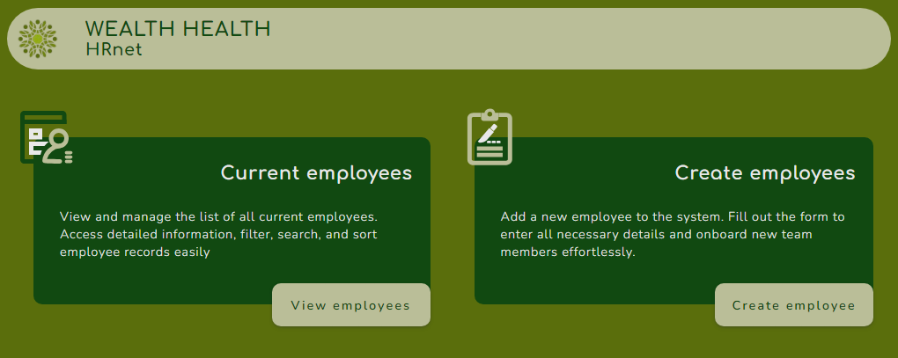

# HRnet

## Faire passer une librairie jQuery vers React

### 📚 Présentation

Ce projet correspond à la migration d'une application web interne jQuery vers React.  
👉 [Code de l'ancienne application](https://github.com/OpenClassrooms-Student-Center/P12_Front-end)  
Le but de ce changement est de réduire la dette technique et d'améliorer la performance de l'application web. 
L'application permet la gestion des dossiers des employés : 

- Ajout de nouveaux employés
- Consultations des employés

Les plugins JQuery ont été remplacés : 

- Select : composant interne
- Modal : [sg-modal-lib](https://www.npmjs.com/package/sg-modal-lib)
- Date picker : [MUIDatePicker](https://mui.com/x/react-date-pickers/date-picker/)
- Table : [AG GRid React](https://www.ag-grid.com/react-data-grid/getting-started/)

Pour le moment, les données sont mockées (employees et departments).  
Les états américains permettant de remplir les options du select sont récupérés grâce à la bibliothèque [states-us](https://www.npmjs.com/package/states-us).

### 💡 Outils et technos

### 📈 Rapports de performances

### 🔨 Installation du projet

Le projet utilise NodeJS(v20.11.1) et `pnpm` 

➡ Cloner le projet 
➡ Ouvrir le dossier dans VSCode (ou tout autre IDE) 
➡ Installer les node-modules : `pnpm install` 

### 🚀 Lancement du projet

➡ Lancer l'application : `pnpm run dev` 

### ⚙ Contraintes techniques

➡ Utiliser Redux pour gérer le state de l'ensemble de l'application. 
➡ Coder en utilisant le paradigme de la programmation fonctionnelle. 
➡ Amélioration du style de l'application. 

### 🏆 Compétences évaluées

➡ Analyser la performance d'une application web. 
➡ Déployer une application front-end. 
➡ Refondre une application pour réduire la dette technique. 
➡ Produire de la documentation technique pour une application. 

# English version

# HRnet

## Migrating a jQuery Library to React

### 📚 Overview

This project involves migrating an internal web application from jQuery to React. 
👉 [Code of the old application](https://github.com/OpenClassrooms-Student-Center/P12_Front-end)  
The goal of this transition is to reduce technical debt and improve the performance of the web application. The application allows for employee file management : 

- Adding new employees
- Viewing employees

jQuery plugins have been replaced with : 

- Select : internal component
- Modal : [sg-modal-lib](https://www.npmjs.com/package/sg-modal-lib)
- Date picker : [MUIDatePicker](https://mui.com/x/react-date-pickers/date-picker/)
- Table : [AG GRid React](https://www.ag-grid.com/react-data-grid/getting-started/)

Pour le moment, les données sont mockées (employees et departments).  
Currently, data (employees and departments) is mocked. U.S. states for populating the select options are retrieved using the [states-us](https://www.npmjs.com/package/states-us) library.

### 💡 Tools and Technologies

### 📈 Performance Reports

### 🔨 Project Installation

The project uses NodeJS(v20.11.1) and `pnpm`. 

➡ Clone the project 
➡ Open the folder in VSCode (or any other IDE) 
➡ Install the node modules: `pnpm install` 

### 🚀 Running the Project

➡ Start the application: `pnpm run dev` 

### ⚙ Technical Constraints

➡ Use Redux to manage the state of the entire application.  
➡ Code using the functional programming paradigm. 
➡ Improve the styling of the application. 

### 🏆 Evaluated Skills

➡ Analyze the performance of a web application. 
➡ Deploy a front-end application. 
➡ Refactor an application to reduce technical debt. 
➡ Produce technical documentation for an application. 
