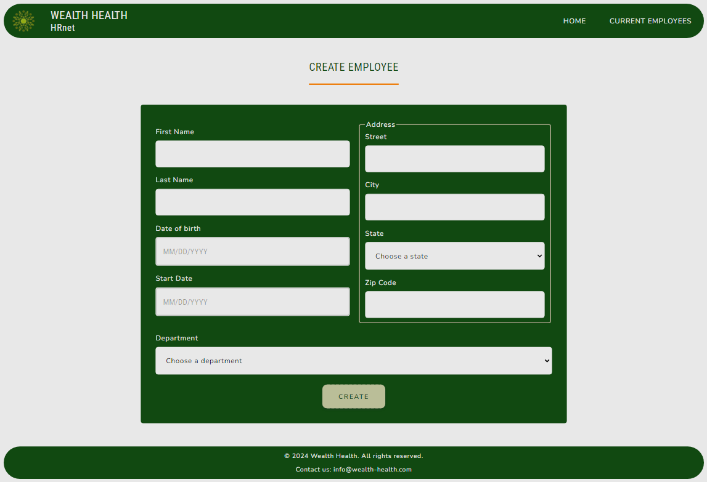

# HRnet (English version below)

## Faire passer une librairie jQuery vers React

### 📚 Présentation

Ce projet correspond à la migration d'une application web interne jQuery vers React.  
👉 [Code de l'ancienne application](https://github.com/OpenClassrooms-Student-Center/P12_Front-end)  
Le but de ce changement est de réduire la dette technique et d'améliorer la performance de l'application web. 
L'application permet la gestion des dossiers des employés : 

- Ajout de nouveaux employés
- Consultations des employés

Les plugins JQuery ont été remplacés : 

- Select : composant interne
- Modal : [sg-modal-lib](https://www.npmjs.com/package/sg-modal-lib)
- Date picker : [MUIDatePicker](https://mui.com/x/react-date-pickers/date-picker/)
- Table : [Material React Table](https://www.material-react-table.com/)

Pour le moment, les données sont mockées (employees et departments).  
Les états américains permettant de remplir les options du select sont récupérés grâce à la bibliothèque [states-us](https://www.npmjs.com/package/states-us).

### 💡 Outils et technos

### 📦 Dépendances

#### **Bibliothèques Principales :**

- **[React](https://reactjs.org/)** (^18.3.1): Une bibliothèque JavaScript pour la construction d'interfaces utilisateur.
- **[React-DOM](https://reactjs.org/docs/react-dom.html)** (^18.3.1): Le package qui sert de point d'entrée pour les chemins de rendu liés au DOM.
- **[Redux](https://redux.js.org/)** (^2.2.7): Un gestionnaire d'état pour les applications JavaScript.
- **[React-Redux](https://react-redux.js.org/)** (^9.1.2): Les liaisons officielles de React pour Redux.
- **[React Router DOM](https://reactrouter.com/web/guides/quick-start)** (^6.26.0): Le routage déclaratif pour React.js.
- **[@reduxjs/toolkit](https://redux-toolkit.js.org/)** (^2.2.7): Un ensemble d'outils pour simplifier l'utilisation de Redux et améliorer les flux de travail.

#### **UI et Stylisation :**

- **[MUI](https://mui.com/)** (^6.0.0): Une bibliothèque de composants React suivant les spécifications Material Design.
- **[MUI X Date Pickers](https://mui.com/x/react-date-pickers/)** (^7.12.1): Un ensemble de composants pour la sélection de dates et d'heures.
- **[Sass](https://sass-lang.com/)** (^1.77.8): Un langage de préprocesseur qui est interprété ou compilé en feuilles de style en cascade (CSS).
- **[Material React Table ](https://www.material-react-table.com/)** (^2.13.1): Une bibliothèque de tableaux de données pour React basée sur Material UI et TanStack Table.

#### **Utilitaires :**

- **[Day.js](https://day.js.org/)** (^1.11.12): Une alternative rapide et légère à Moment.js pour la gestion des dates.
- **[Prop-Types](https://www.npmjs.com/package/prop-types)** (^15.8.1): Vérification des types à l'exécution pour les props React et les objets similaires.
- **[React Hook Form](https://react-hook-form.com/)** (^7.52.2): Une bibliothèque de formulaires performante, flexible et extensible pour React.
- **[Redux Persist](https://github.com/rt2zz/redux-persist)** (^6.0.0): Une bibliothèque pour persister et réhydrater un store Redux.
- **[sg-modal-lib](https://www.npmjs.com/package/sg-modal-lib)** (^1.0.4): Composant pour la création de modale.
- **[States-US](https://www.npmjs.com/package/states-us)** (^1.0.4): Une bibliothèque pour les données des états américains.
- **[UUID](https://github.com/uuidjs/uuid)** (^10.0.0): Une bibliothèque pour générer des UUIDs.

#### **Outils de Développement :**

- **[Vite](https://vitejs.dev/)** (^5.3.4): Un outil de développement frontend de nouvelle génération visant à fournir une expérience de développement plus rapide et plus légère.
- **[ESLint](https://eslint.org/)** (^8.57.0): Un outil pour identifier et signaler les erreurs trouvés dans le code ECMAScript/JavaScript.
- **[Plugins ESLint](https://eslint.org/docs/user-guide/configuring/plugins)** : Plugins pour étendre les fonctionnalités d'ESLint, y compris `eslint-plugin-react`(^7.34.3) pour des règles de linting spécifiques à React.

### 🔨 Installation du projet

#### **Prérequis**

- **[NodeJS](https://nodejs.org/fr/)** (^20.11.1)
- **[Git](https://git-scm.com/))** (^2.44.0)
- **[npm](https://www.npmjs.com/)** (^10.2.4)

➡ Cloner le projet 
➡ Ouvrir le dossier dans VSCode (ou tout autre IDE) 
➡ Installer les dépendances : `pnpm install` 

### 🚀 Lancement du projet

➡ Lancer l'application : `pnpm run dev` 

### ⚙ Contraintes techniques

➡ Utiliser Redux pour gérer le state de l'ensemble de l'application. 
➡ Coder en utilisant le paradigme de la programmation fonctionnelle. 
➡ Amélioration du style de l'application. 

### 📈 Rapports de performances

### 🏆 Compétences évaluées

➡ Analyser la performance d'une application web. 
➡ Déployer une application front-end. 
➡ Refondre une application pour réduire la dette technique. 
➡ Produire de la documentation technique pour une application. 

### Auteurs

- **Ségolène Ganzin** ([GitHub Profile](https://github.com/segoleneganzin/))

# English version

# HRnet

## Migrating a jQuery Library to React

### 📚 Overview

This project involves migrating an internal web application from jQuery to React. 
👉 [Code of the old application](https://github.com/OpenClassrooms-Student-Center/P12_Front-end)  
The goal of this transition is to reduce technical debt and improve the performance of the web application. The application allows for employee file management : 

- Adding new employees
- Viewing employees

jQuery plugins have been replaced with : 

- Select : internal component
- Modal : [sg-modal-lib](https://www.npmjs.com/package/sg-modal-lib)
- Date picker : [MUIDatePicker](https://mui.com/x/react-date-pickers/date-picker/)
- Table : [Material React Table](https://www.material-react-table.com/)

Pour le moment, les données sont mockées (employees et departments).  
Currently, data (employees and departments) is mocked. U.S. states for populating the select options are retrieved using the [states-us](https://www.npmjs.com/package/states-us) library.

### 💡 Tools and Technologies

### 📦 Dependencies

#### **Core Libraries:**

- **[React](https://reactjs.org/)** (^18.3.1): A JavaScript library for building user interfaces.
- **[React-DOM](https://reactjs.org/docs/react-dom.html)** (^18.3.1): The package that serves as the entry point for the DOM-related rendering paths.
- **[Redux](https://redux.js.org/)** (^2.2.7): A predifabble state container for JavaScript apps.
- **[React-Redux](https://react-redux.js.org/)** (^9.1.2): Official React bindings for Redux.
- **[React Router DOM](https://reactrouter.com/web/guides/quick-start)** (^6.26.0): Declarative routing for React.js.
- **[@reduxjs/toolkit](https://redux-toolkit.js.org/)** (^2.2.7): A set of tools to simplify the use of Redux and improve workflows.

#### **UI and Styling:**

- **[MUI](https://mui.com/)** (^6.0.0): A library of React components based on Material Design specifications.
- **[MUI X Date Pickers](https://mui.com/x/react-date-pickers/)** (^7.12.1): A set of components for date and time picking.
- **[Sass](https://sass-lang.com/)** (^1.77.8): A preprocessor scripting language that is interpreted or compiled into Cascading Style Sheets (CSS).
- **[Material React Table ](https://www.material-react-table.com/)** (^2.13.1): A data table library for React based on Material UI and TanStack Table.

#### **Utilities:**

- **[Day.js](https://day.js.org/)** (^1.11.12): A fast and lightweight alternative to Moment.js for date handling.
- **[Prop-Types](https://www.npmjs.com/package/prop-types)** (^15.8.1): Runtime type checking for React props and similar objects.
- **[React Hook Form](https://react-hook-form.com/)** (^7.52.2): A performant, flexible, and extensible forms library for React.
- **[Redux Persist](https://github.com/rt2zz/redux-persist)** (^6.0.0): A library to persist and rehydrate a Redux store.
- **[sg-modal-lib](https://www.npmjs.com/package/sg-modal-lib)** (^1.0.4): Component for modal creation.
- **[States-US](https://www.npmjs.com/package/states-us)** (^1.0.4): A library for US state data.
- **[UUID](https://github.com/uuidjs/uuid)** (^10.0.0): A library for generating UUIDs.

#### **Development Tools:**

- **[Vite](https://vitejs.dev/)** (^5.3.4): A next-generation frontend tooling that aims to provide a faster and leaner development experience.
- **[ESLint](https://eslint.org/)** (^8.57.0): A tool for identifying and reporting on patterns found in ECMAScript/JavaScript code.
- **[ESLint Plugins](https://eslint.org/docs/user-guide/configuring/plugins)**: Plugins to extend ESLint functionality, including `eslint-plugin-react` (^7.34.3) for React-specific linting rules.

### 🔨 Project Installation

#### **Prerequisites**

- **[NodeJS](https://nodejs.org/fr/)** (^20.11.1)
- **[Git](https://git-scm.com/))** (^2.44.0)
- **[npm](https://www.npmjs.com/)** (^10.2.4)

➡ Clone the project 
➡ Open the folder in VSCode (or any other IDE) 
➡ Install dependencies : `pnpm install` 

### 🚀 Running the Project

➡ Start the application: `pnpm run dev` 

### ⚙ Technical Constraints

➡ Use Redux to manage the state of the entire application.  
➡ Code using the functional programming paradigm. 
➡ Improve the styling of the application. 

### 📈 Performance Reports

### 🏆 Evaluated Skills

➡ Analyze the performance of a web application. 
➡ Deploy a front-end application. 
➡ Refactor an application to reduce technical debt. 
➡ Produce technical documentation for an application. 

### Author

- **Ségolène Ganzin** - Initial work and main development ([GitHub Profile](https://github.com/segoleneganzin/))
