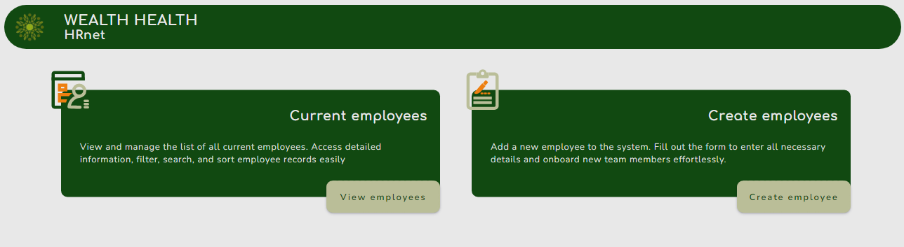

# HRnet

## Faire passer une librairie jQuery vers React

### 📚 Présentation

Ce projet correspond à la migration d'une application web interne jQuery vers React.  
👉 [Code de l'ancienne application](https://github.com/OpenClassrooms-Student-Center/P12_Front-end)  
Le but de ce changement est de réduire la dette technique et d'améliorer la performance de l'application web. 
L'application permet la gestion des dossiers des employés : 

- Ajout de nouveaux employés
- Consultations des employés

Les plugins JQuery ont été remplacés : 

- Select : composant interne
- Modal : [sg-modal-lib](https://www.npmjs.com/package/sg-modal-lib)
- Date picker : [MUIDatePicker](https://mui.com/x/react-date-pickers/date-picker/)
- Table : [AG GRid React](https://www.ag-grid.com/react-data-grid/getting-started/)

Pour le moment, les données sont mockées (employees et departments).  
Les états américains permettant de remplir les options du select sont récupérés grâce à la bibliothèque [states-us](https://www.npmjs.com/package/states-us).

### 💡 Outils et technos

### 📈 Rapports de performances

### 🔨 Installation du projet

Le projet utilise NodeJS(v20.11.1) et `pnpm` 

➡ Cloner le projet 
➡ Ouvrir le dossier dans VSCode (ou tout autre IDE) 
➡ Installer les dépendances : `pnpm install` 

### 🚀 Lancement du projet

➡ Lancer l'application : `pnpm run dev` 

### ⚙ Contraintes techniques

➡ Utiliser Redux pour gérer le state de l'ensemble de l'application. 
➡ Coder en utilisant le paradigme de la programmation fonctionnelle. 
➡ Amélioration du style de l'application. 

### 📦 Dépendances

#### **Bibliothèques Principales :**

- **[React](https://reactjs.org/)** : Une bibliothèque JavaScript pour la construction d'interfaces utilisateur.
- **[React-DOM](https://reactjs.org/docs/react-dom.html)** : Le package qui sert de point d'entrée pour les chemins de rendu liés au DOM.
- **[Redux](https://redux.js.org/)** : Un conteneur d'état prévisible pour les applications JavaScript.
- **[React-Redux](https://react-redux.js.org/)** : Les liaisons officielles de React pour Redux.
- **[React Router DOM](https://reactrouter.com/web/guides/quick-start)** : Le routage déclaratif pour React.js.

#### **UI et Stylisation :**

- **[MUI X Date Pickers](https://mui.com/x/react-date-pickers/)** : Un ensemble de composants pour la sélection de dates et d'heures.
- **[AG Grid](https://www.ag-grid.com/)** : Une grille de données riche en fonctionnalités pour React.
- **[Sass](https://sass-lang.com/)** : Un langage de préprocesseur qui est interprété ou compilé en feuilles de style en cascade (CSS).

#### **Utilitaires :**

- **[Axios](https://axios-http.com/)** : Un client HTTP basé sur des promesses pour le navigateur et Node.js.
- **[Day.js](https://day.js.org/)** : Une alternative rapide et légère à Moment.js pour la gestion des dates.
- **[Prop-Types](https://www.npmjs.com/package/prop-types)** : Vérification des types à l'exécution pour les props React et les objets similaires.
- **[React Hook Form](https://react-hook-form.com/)** : Une bibliothèque de formulaires performante, flexible et extensible pour React.
- **[Redux Persist](https://github.com/rt2zz/redux-persist)** : Une bibliothèque pour persister et réhydrater un store Redux.
- **[States-US](https://www.npmjs.com/package/states-us)** : Une bibliothèque pour les données des états américains.
- **[UUID](https://github.com/uuidjs/uuid)** : Une bibliothèque pour générer des UUIDs.

#### **Outils de Développement :**

- **[Vite](https://vitejs.dev/)** : Un outil de développement frontend de nouvelle génération visant à fournir une expérience de développement plus rapide et plus légère.
- **[ESLint](https://eslint.org/)** : Un outil pour identifier et signaler les motifs trouvés dans le code ECMAScript/JavaScript.
- **[Plugins ESLint](https://eslint.org/docs/user-guide/configuring/plugins)** : Plugins pour étendre les fonctionnalités d'ESLint, y compris `eslint-plugin-react` pour des règles de linting spécifiques à React.

### 🏆 Compétences évaluées

➡ Analyser la performance d'une application web. 
➡ Déployer une application front-end. 
➡ Refondre une application pour réduire la dette technique. 
➡ Produire de la documentation technique pour une application. 

# English version

# HRnet

## Migrating a jQuery Library to React

### 📚 Overview

This project involves migrating an internal web application from jQuery to React. 
👉 [Code of the old application](https://github.com/OpenClassrooms-Student-Center/P12_Front-end)  
The goal of this transition is to reduce technical debt and improve the performance of the web application. The application allows for employee file management : 

- Adding new employees
- Viewing employees

jQuery plugins have been replaced with : 

- Select : internal component
- Modal : [sg-modal-lib](https://www.npmjs.com/package/sg-modal-lib)
- Date picker : [MUIDatePicker](https://mui.com/x/react-date-pickers/date-picker/)
- Table : [AG GRid React](https://www.ag-grid.com/react-data-grid/getting-started/)

Pour le moment, les données sont mockées (employees et departments).  
Currently, data (employees and departments) is mocked. U.S. states for populating the select options are retrieved using the [states-us](https://www.npmjs.com/package/states-us) library.

### 💡 Tools and Technologies

### 📈 Performance Reports

### 🔨 Project Installation

The project uses NodeJS(v20.11.1) and `pnpm`. 

➡ Clone the project 
➡ Open the folder in VSCode (or any other IDE) 
➡ Install dependencies : `pnpm install` 

### 🚀 Running the Project

➡ Start the application: `pnpm run dev` 

### ⚙ Technical Constraints

➡ Use Redux to manage the state of the entire application.  
➡ Code using the functional programming paradigm. 
➡ Improve the styling of the application. 

### 📦 Dependencies

#### **Core Libraries:**

- **[React](https://reactjs.org/)**: A JavaScript library for building user interfaces.
- **[React-DOM](https://reactjs.org/docs/react-dom.html)**: The package that serves as the entry point for the DOM-related rendering paths.
- **[Redux](https://redux.js.org/)**: A predictable state container for JavaScript apps.
- **[React-Redux](https://react-redux.js.org/)**: Official React bindings for Redux.
- **[React Router DOM](https://reactrouter.com/web/guides/quick-start)**: Declarative routing for React.js.

#### **UI and Styling:**

- **[MUI X Date Pickers](https://mui.com/x/react-date-pickers/)**: A set of components for date and time picking.
- **[AG Grid](https://www.ag-grid.com/)**: A feature-rich data grid for React.
- **[Sass](https://sass-lang.com/)**: A preprocessor scripting language that is interpreted or compiled into Cascading Style Sheets (CSS).

#### **Utilities:**

- **[Axios](https://axios-http.com/)**: A promise-based HTTP client for the browser and Node.js.
- **[Day.js](https://day.js.org/)**: A fast and lightweight alternative to Moment.js for date handling.
- **[Prop-Types](https://www.npmjs.com/package/prop-types)**: Runtime type checking for React props and similar objects.
- **[React Hook Form](https://react-hook-form.com/)**: A performant, flexible, and extensible forms library for React.
- **[Redux Persist](https://github.com/rt2zz/redux-persist)**: A library to persist and rehydrate a Redux store.
- **[States-US](https://www.npmjs.com/package/states-us)**: A library for US state data.
- **[UUID](https://github.com/uuidjs/uuid)**: A library for generating UUIDs.

#### **Development Tools:**

- **[Vite](https://vitejs.dev/)**: A next-generation frontend tooling that aims to provide a faster and leaner development experience.
- **[ESLint](https://eslint.org/)**: A tool for identifying and reporting on patterns found in ECMAScript/JavaScript code.
- **[ESLint Plugins](https://eslint.org/docs/user-guide/configuring/plugins)**: Plugins to extend ESLint functionality, including `eslint-plugin-react` for React-specific linting rules.

### 🏆 Evaluated Skills

➡ Analyze the performance of a web application. 
➡ Deploy a front-end application. 
➡ Refactor an application to reduce technical debt. 
➡ Produce technical documentation for an application. 
