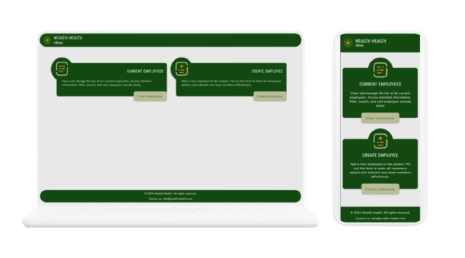
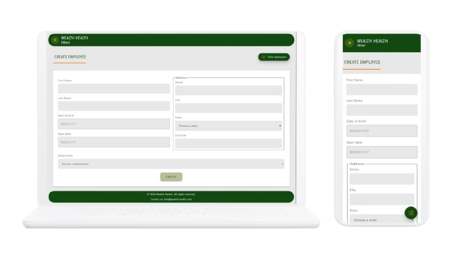
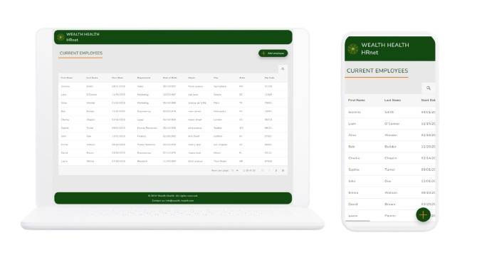

# HRnet (English version below)

## Faire passer une librairie jQuery vers React

### 📚 Présentation

Ce projet correspond à la migration d'une application web interne jQuery vers React.  
👉 [Code de l'ancienne application](https://github.com/OpenClassrooms-Student-Center/P12_Front-end)  
Le but de ce changement est de réduire la dette technique et d'améliorer la performance de l'application web.

L'application permet la gestion des dossiers des employés :

- Ajout de nouveaux employés
- Consultations des employés

Les plugins JQuery ont été remplacés :

- Select : composant interne
- Modal : [sg-modal-lib](https://www.npmjs.com/package/sg-modal-lib)
- Date picker : [MUIDatePicker](https://mui.com/x/react-date-pickers/date-picker/)
- Table : [react-data-table-component](https://www.npmjs.com/package/react-data-table-component)

Pour le moment, les données sont mockées (employees et departments).

Les états américains permettant de remplir les options du select sont récupérés grâce à la bibliothèque [states-us](https://www.npmjs.com/package/states-us).

Des test unitaires ont été mis en place avec vitest.

Le fichier manifest.json configure l'application web Wealth Health - HRnet en spécifiant des métadonnées telles que le nom de l'application, une description, les icônes, ainsi que les paramètres de démarrage.  
Ce fichier garantit une meilleure expérience utilisateur pour les applications web progressives (PWA), avec un affichage optimisé, une icône pour les appareils mobiles, et un thème personnalisé.

Il n'y a ni robots.txt ni sitemap.xml car le SEO n'est pas l'objectif, étant donné qu'il s'agit d'une application web interne.

### 🖥 Mock-up du site

#### Page d'accueil

#### Création d'employé

#### Liste d'employés

### 💡 Outils et technos

### 🔨 Installation du projet

#### Prérequis

- **[NodeJS](https://nodejs.org/fr/)** (^20.11.1)
- **[Git](https://git-scm.com/)** (^2.44.0)
- **[npm](https://www.npmjs.com/)** (^10.2.4)

➡ Cloner le projet  
➡ Ouvrir le dossier dans VSCode (ou tout autre IDE)  
➡ Installer les dépendances : `pnpm install`

### 🚀 Lancement du projet

➡ Lancer l'application : `pnpm run dev`

### ⚙ Contraintes techniques

➡ Utiliser Redux pour gérer le state de l'ensemble de l'application.  
➡ Coder en utilisant le paradigme de la programmation fonctionnelle.  
➡ Amélioration du style de l'application.  
➡ Amélioration des performances de l'application.

### 📈 Rapports de performances

### 📦 Dépendances

#### Bibliothèques Principales

- **[React](https://reactjs.org/)** (^18.3.1): Une bibliothèque JavaScript pour la construction d'interfaces utilisateur.
- **[React-DOM](https://reactjs.org/docs/react-dom.html)** (^18.3.1): Le package qui sert de point d'entrée pour les chemins de rendu liés au DOM.
- **[React-Redux](https://react-redux.js.org/)** (^9.1.2): Les liaisons officielles de React pour Redux.
- **[React Router DOM](https://reactrouter.com/web/guides/quick-start)** (^6.26.2): Le routage déclaratif pour React.js.
- **[@reduxjs/toolkit](https://redux-toolkit.js.org/)** (^2.2.8): Un ensemble d'outils pour simplifier l'utilisation de Redux et améliorer les flux de travail.

#### UI et Stylisation

- **[MUI](https://mui.com/)** (^6.0.0): Une bibliothèque de composants React suivant les spécifications Material Design.
- **[MUI X Date Pickers](https://mui.com/x/react-date-pickers/)** (^7.19.0): Un ensemble de composants pour la sélection de dates et d'heures.
- **[Sass](https://sass-lang.com/)** (^1.79.4): Un langage de préprocesseur qui est interprété ou compilé en feuilles de style en cascade (CSS).
- **[React Data Table Component](https://react-data-table-component.netlify.app/)** (^7.6.2): Une bibliothèque pour la gestion des tableaux de données dans les applications React.

#### Utilitaires

- **[Day.js](https://day.js.org/)** (^1.11.13): Une alternative rapide et légère à Moment.js pour la gestion des dates.
- **[Prop-Types](https://www.npmjs.com/package/prop-types)** (^15.8.1): Vérification des types à l'exécution pour les props React et les objets similaires.
- **[React Hook Form](https://react-hook-form.com/)** (^7.53.0): Une bibliothèque de formulaires performante, flexible et extensible pour React.
- **[Redux Persist](https://github.com/rt2zz/redux-persist)** (^6.0.0): Une bibliothèque pour persister et réhydrater un store Redux.
- **[sg-modal-lib](https://www.npmjs.com/package/sg-modal-lib)** (^1.1.7): Composant pour la création de modale.
- **[States-US](https://www.npmjs.com/package/states-us)** (^1.1.1): Une bibliothèque pour les données des états américains.
- **[UUID](https://github.com/uuidjs/uuid)** (^10.0.0): Une bibliothèque pour générer des UUIDs.
- **[Styled-components](https://styled-components.com/)** (^6.1.13): Une bibliothèque CSS-in-JS qui permet de styliser les composants React.

#### Outils de Développement

- **[Vite](https://vitejs.dev/)** (^5.4.8): Un outil de développement frontend de nouvelle génération visant à fournir une expérience de développement plus rapide et plus légère.
- **[ESLint](https://eslint.org/)** (^9.12.0): Un outil pour identifier et signaler les erreurs trouvées dans le code ECMAScript/JavaScript.
- **[Plugins ESLint](https://eslint.org/docs/user-guide/configuring/plugins)**: Plugins pour étendre les fonctionnalités d'ESLint, y compris `eslint-plugin-react` (^7.37.1) pour des règles de linting spécifiques à React.
- **[@testing-library/jest-dom](https://github.com/testing-library/jest-dom)** (^6.5.0): Matchers personnalisés pour Jest afin de tester l'état du DOM.
- **[@testing-library/react](https://testing-library.com/docs/react-testing-library/intro)** (^16.0.1): Utilitaires pour tester les composants React.
- **[@vitejs/plugin-react](https://vitejs.dev/plugin-react)** (^4.3.2): Plugin Vite pour React pour une expérience de construction et de développement optimale.
- **[@vitest/coverage-v8](https://vitest.dev/)** (^2.1.2): Framework de test de Vite pour exécuter des tests unitaires avec couverture.
- **[eslint-plugin-react-hooks](https://www.npmjs.com/package/eslint-plugin-react-hooks)** (^4.6.2): Plugin ESLint pour faire respecter les règles des Hooks.
- **[eslint-plugin-react-refresh](https://www.npmjs.com/package/eslint-plugin-react-refresh)** (^0.4.12): Plugin ESLint pour React Fast Refresh.
- **[globals](https://www.npmjs.com/package/globals)** (^15.11.0): Variables globales utilisées dans différents environnements (Node.js, navigateur, etc.).
- **[jsdom](https://github.com/jsdom/jsdom)** (^25.0.1): Une implémentation JavaScript des normes DOM et HTML pour les tests dans Node.js.
- **[Sass](https://sass-lang.com/)** (^1.79.4): Un langage de préprocesseur qui est interprété ou compilé en feuilles de style en cascade (CSS).
- **[Vitest](https://vitest.dev/)** (^2.1.2): Un framework de test unitaire compatible avec Vite.

### 🏆 Compétences évaluées

➡ Analyser la performance d'une application web.  
➡ Déployer une application front-end.  
➡ Refondre une application pour réduire la dette technique.  
➡ Produire de la documentation technique pour une application.

### 👷‍♀️ Auteurs

- **Ségolène Ganzin** ([GitHub Profile](https://github.com/segoleneganzin/))

# English version

# HRnet

## Migrating a jQuery Library to React

### 📚 Overview

This project involves migrating an internal web application from jQuery to React.  
👉 [Code of the old application](https://github.com/OpenClassrooms-Student-Center/P12_Front-end)  
The goal of this transition is to reduce technical debt and improve the performance of the web application.

The application allows for employee file management :

- Adding new employees
- Viewing employees

jQuery plugins have been replaced with :

- Select : internal component
- Modal : [sg-modal-lib](https://www.npmjs.com/package/sg-modal-lib)
- Date picker : [MUIDatePicker](https://mui.com/x/react-date-pickers/date-picker/)
- Table : [Material React Table](https://www.material-react-table.com/)

For the moment, the data is mocked up (employees and departments).

Currently, data (employees and departments) is mocked. U.S. states for populating the select options are retrieved using the [states-us](https://www.npmjs.com/package/states-us) library.

Unit tests were set up with vitest.

The manifest.json file configures the Wealth Health - HRnet web application, specifying metadata such as application name, description, icons and startup parameters.  
This file guarantees a better user experience for progressive web applications (PWA), with an optimized display, an icon for mobile devices, and a customized theme.

There are no robots.txt or sitemap.xml files, as SEO is not the objective, given that this is an internal web application.

### 🖥 Site mock up

#### Home page

#### Create employee

#### Employees list

### 💡 Tools and Technologies

### 🔨 Project Installation

#### Prerequisites

- **[NodeJS](https://nodejs.org/fr/)** (^20.11.1)
- **[Git](https://git-scm.com/)** (^2.44.0)
- **[npm](https://www.npmjs.com/)** (^10.2.4)

➡ Clone the project  
➡ Open the folder in VSCode (or any other IDE)  
➡ Install dependencies : `pnpm install`

### 🚀 Running the Project

➡ Start the application: `pnpm run dev`

### ⚙ Technical Constraints

➡ Use Redux to manage the state of the entire application.  
➡ Code using the functional programming paradigm.  
➡ Improve the styling of the application.  
➡ Improved application performance.

### 📈 Performance Reports

### 📦 Dependencies

#### Main Libraries

- **[React](https://reactjs.org/)** (^18.3.1): A JavaScript library for building user interfaces.
- **[React-DOM](https://reactjs.org/docs/react-dom.html)** (^18.3.1): The package that serves as the entry point for DOM-related rendering paths.
- **[React-Redux](https://react-redux.js.org/)** (^9.1.2): The official React bindings for Redux.
- **[React Router DOM](https://reactrouter.com/web/guides/quick-start)** (^6.26.2): Declarative routing for React.js.
- **[@reduxjs/toolkit](https://redux-toolkit.js.org/)** (^2.2.8): A set of tools for simplifying Redux usage and improving workflows.

#### UI and Styling

- **[MUI](https://mui.com/)** (^6.0.0): A React component library following Material Design specifications.
- **[MUI X Date Pickers](https://mui.com/x/react-date-pickers/)** (^7.19.0): A set of components for date and time selection.
- **[Sass](https://sass-lang.com/)** (^1.79.4): A preprocessor language that is interpreted or compiled into cascading style sheets (CSS).
- **[React Data Table Component](https://react-data-table-component.netlify.app/)** (^7.6.2): A library for managing data tables in React applications.

#### Utilities

- **[Day.js](https://day.js.org/)** (^1.11.13): A fast and lightweight alternative to Moment.js for date management.
- **[Prop-Types](https://www.npmjs.com/package/prop-types)** (^15.8.1): Runtime type checking for React props and similar objects.
- **[React Hook Form](https://react-hook-form.com/)** (^7.53.0): A performant, flexible, and extensible form library for React.
- **[Redux Persist](https://github.com/rt2zz/redux-persist)** (^6.0.0): A library to persist and rehydrate a Redux store.
- **[sg-modal-lib](https://www.npmjs.com/package/sg-modal-lib)** (^1.1.7): A component for creating modals.
- **[States-US](https://www.npmjs.com/package/states-us)** (^1.1.1): A library for data on U.S. states.
- **[UUID](https://github.com/uuidjs/uuid)** (^10.0.0): A library for generating UUIDs.
- **[Styled-components](https://styled-components.com/)** (^6.1.13): A CSS-in-JS library that allows styling React components.

#### Development Tools

- **[Vite](https://vitejs.dev/)** (^5.4.8): A next-generation frontend development tool designed to provide a faster and lighter development experience.
- **[ESLint](https://eslint.org/)** (^9.12.0): A tool for identifying and reporting errors found in ECMAScript/JavaScript code.
- **[ESLint Plugins](https://eslint.org/docs/user-guide/configuring/plugins)**: Plugins to extend ESLint's functionality, including `eslint-plugin-react` (^7.37.1) for React-specific linting rules.
- **[@testing-library/jest-dom](https://github.com/testing-library/jest-dom)** (^6.5.0): Custom matchers for Jest to test the state of the DOM.
- **[@testing-library/react](https://testing-library.com/docs/react-testing-library/intro)** (^16.0.1): Utilities for testing React components.
- **[@vitejs/plugin-react](https://vitejs.dev/plugin-react)** (^4.3.2): Vite plugin for React for optimal build and development experience.
- **[@vitest/coverage-v8](https://vitest.dev/)** (^2.1.2): Vite's test framework for running unit tests with coverage.
- **[eslint-plugin-react-hooks](https://www.npmjs.com/package/eslint-plugin-react-hooks)** (^4.6.2): ESLint plugin for enforcing the Rules of Hooks.
- **[eslint-plugin-react-refresh](https://www.npmjs.com/package/eslint-plugin-react-refresh)** (^0.4.12): ESLint plugin for React Fast Refresh.
- **[globals](https://www.npmjs.com/package/globals)** (^15.11.0): Global variables that are used in different environments (Node.js, browser, etc.).
- **[jsdom](https://github.com/jsdom/jsdom)** (^25.0.1): A JavaScript implementation of the DOM and HTML standards for testing in Node.js.
- **[Sass](https://sass-lang.com/)** (^1.79.4): A preprocessor scripting language that is interpreted or compiled into Cascading Style Sheets (CSS).
- **[Vitest](https://vitest.dev/)** (^2.1.2): A unit testing framework that is compatible with Vite.

### 🏆 Evaluated Skills

➡ Analyze the performance of a web application.  
➡ Deploy a front-end application.  
➡ Refactor an application to reduce technical debt.  
➡ Produce technical documentation for an application.

### 👷‍♀️ Author

- **Ségolène Ganzin** - Initial work and main development ([GitHub Profile](https://github.com/segoleneganzin/))
